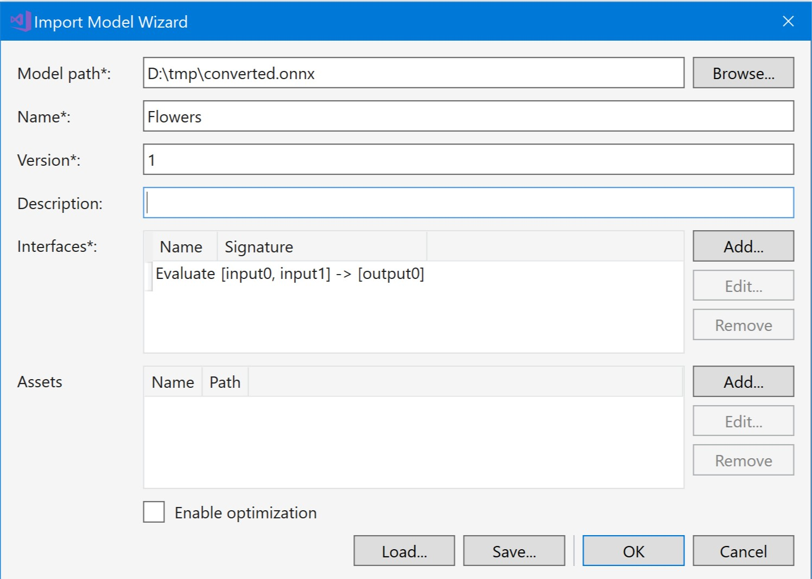

# Hướng dẫn Convert Tensorflow Model thành ONNX Model (*.pb -> *.onnx)
## 1. Tại sao lại là ONNX

> ONNX is a open format to represent deep learning models. With ONNX, AI developers can more easily move models between state-of-the-art tools and choose the combination that is best for them. ONNX is developed and supported by a community of partners.

**Open Neural Network Exchange Format** là một thỏa thuận giữa Microsoft và các công ty khác hoạt động trong lĩnh vực AI nhằm tạo ra định dạng chung cho các mô hình Neural Network (NN).

Do được Microsoft hỗ trợ, nên ONNX sẽ được hỗ trợ trong việc phát triển các ứng dụng thuộc nền tảng Windows.

## 2. Vấn đề
Gồm 3 công đoạn:
 1. Tôi sẽ tiến thành xây dựng mô hình nhận dạng hoa (flowers) dựa trên kiến trúc NN có sẵn từ Tensorflow.
 2. Sau đó, convert mô hình Tensorflow thành ONNX.
 3. Tạo Inference Model Library (C#) từ công cụ Microsoft AI Tools.
## 3. Môi trường
Vì đặc thù của mô hình object detection của Tensorflow, nên việc huấn luyện và convert được thực hiện trong môi trường Linux. Trường hợp này, tôi sử dụng Compute Engine **VPS** của Google Cloud Platform. Bạn cũng có thể sử dụng một máy ảo local (VMWare) chạy Ubuntu 18.04 LTS

Để tạo thư viện C# cho NN, tôi cài đặt Extension MS AI Tools trên Visual Studio 2017.
## 4. Phương pháp
### 1. Thực hiện training mô hình Flowers
SSH đến VPS của bạn. Chuẩn bị môi trường chạy Python cùng Tensorflow

```bash
~ $ sudo apt update
~ $ sudo apt upgrade
~ $ sudo apt install python3
~ $ sudo apt install python-pip
~ $ sudo pip3 install tensorflow
```

> Python phiên bản 3.6. Kiểm tra bằng lệnh: python3 --version

Thực hiện clone git repo này về VPS

```bash
~ $ git clone https://github.com/AmbroseNTK/TF2ONNX.git
```
Tiến hành Training model

```bash
~ $ cd TF2ONNX
/TF2ONNX $  python3 retrain.py --image_dir flowers
/TF2ONNX cd ../
```
Sau khi quá trình training hoàn tất, tất cả kết quả được lưu ở thư mục **root:/tmp/**
Bạn đã nhận được mô hình NN nhận dạng hoa: 

**root:/tmp/output_model.pb**

**root:/tmp/output_labels.txt**


Tiếp tục, tiến hành convert file model *.pb thành *.onnx

Clone repo tensorflow về máy

```bash
~ $ git clone https://github.com/tensorflow/tensorflow.git
```
Cài đặt Benzel để build các tool cần thiết của Tensorflow

```bash
~ $ sudo apt-get install pkg-config zip g++ zlib1g-dev unzip python
~ $  wget https://github.com/bazelbuild/bazel/releases/download/0.22.0/bazel-0.22.0-installer-linux-x86_64.sh
~ $ sudo chmod +X bazel-0.22.0-installer-linux-x86_64.sh
~ $ sudo ./bazel-0.22.0-installer-linux-x86_64.sh
~ $ export PATH="$PATH:$HOME/bin"
```
Tiến hành build (Tốn khoảng 10 -> 15 phút)
```bash
~ $ cd tensorflow
/tensorflow $ bazel build tensorflow/tools/graph_transforms:summarize_graph
```
Sau khi build xong, bạn sử dụng công cụ summarize_graph để xác định input và output của model

```bash
/tensorflow $ bazel-bin/tensorflow/tools/graph_transforms/summarize_graph --in_graph=/tmp/output_graph.pb
```
Kết quả như sau

```bash
:~/tensorflow$ bazel-bin/tensorflow/tools/graph_transforms/summarize_graph --in_graph=/tmp/output_graph.pb
Found 1 possible inputs: (name=Placeholder, type=float(1), shape=[?,299,299,3]) 
No variables spotted.
Found 1 possible outputs: (name=final_result, op=Softmax) 
Found 21830264 (21.83M) const parameters, 0 (0) variable parameters, and 0 control_edges
Op types used: 490 Const, 378 Identity, 94 Conv2D, 94 FusedBatchNorm, 94 Relu, 15 ConcatV2, 9 AvgPool, 4 MaxPool, 1 Add, 1 Mean, 1 Mul, 1 Placeholder, 1 PlaceholderWithDefault, 1 MatMul, 1 Softmax, 1 Squeeze, 1 Sub
To use with tensorflow/tools/benchmark:benchmark_model try these arguments:
bazel run tensorflow/tools/benchmark:benchmark_model -- --graph=/tmp/output_graph.pb --show_flops --input_layer=Placeholder --input_layer_type=float --input_layer_shape=-1,299,299,3 --output_layer=final_result
```

Dựa trên kết quả này, ta biết input là: **Placeholder**, output là **final_result**

### 2. Convert *.pb thành *.onnx

Cài đặt tf2onnx

```bash
~ $ pip install -U tf2onnx
```
Converting...

```bash
~ $ python3 -m tf2onnx.convert --input /tmp/output_graph.pb --inputs Placeholder:0 --outputs final_result:0 --output /tmp/converted.onnx
```
> :0 nghĩa là thứ tự thứ 0 của tham số trong input và output

Kết quả là file **root:/tmp/converted.onnx**

Copy file converted.onnx về máy bằng WinSCP cho VPS, riêng Google Cloud Platform tôi sử dụng các lệnh sau:

Tại máy Windows: Cài GCloud tool và chạy các lệnh sau
```bash
$ gcloud auth login
$ gcloud config set project <MY_PROJECT>
$ gcloud compute scp <ACCOUNT>@<VPS>:/tmp/converted.onnx <LOCAL_DIR>
```
Sau khi hoàn tất, file converted.onnx sẽ được copy đến vị trí LOCAL_DIR trên máy bạn

### 3. Import vào Inference Model Library
Thực hiện cài [extension](https://visualstudio.microsoft.com/downloads/ai-tools-vs/) trên Visual Studio 2017.

Tạo Project loại: Model Inference Library

Xuất hiện Wizard, thực hiện như hình sau


Nhấn OK để Import model vào Project.
Sau khi đã có Library, các bạn có thể sử dụng tùy ý thông qua việc Add Reference vào những Project khác. Hướng dẫn có thể xem thêm [tại đây](https://docs.microsoft.com/en-us/windows/ai/get-started-uwp)
